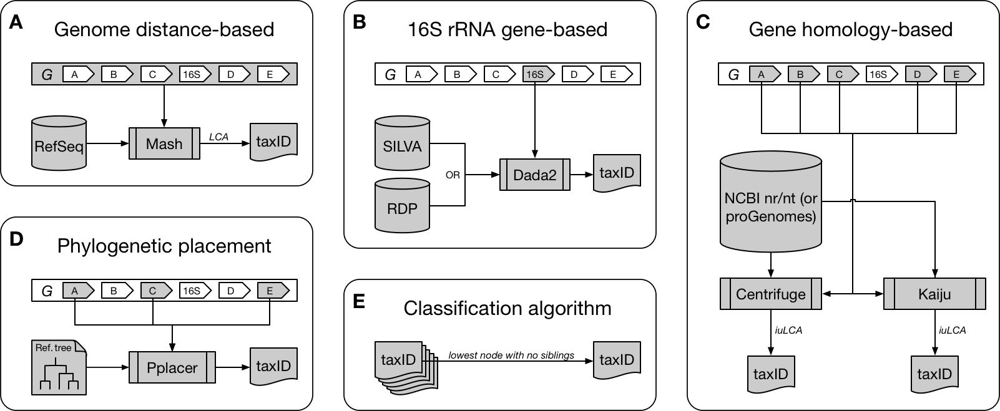

# CAMITAX: Taxon labels for microbial genomes



**The CAMITAX taxonomic assignment workflow.**
CAMITAX assigns one NCBI Taxonomy ID (taxID) to an input genome *G* by combining genome distance-, 16S rRNA gene-, and gene homology-based taxonomic assignments with phylogenetic placement.
**(A) Genome distance-based assignment.**
CAMITAX uses Mash to estimate the average nucleotide identity (ANI) between *G* and more than a hundred thousand microbial genomes in RefSeq, and assigns the lowest common ancestor (LCA) of genomes showing >95% ANI, which was found to be a clear species boundary.
**(B) 16S rRNA gene-based assignment.**
CAMITAX uses Dada2 to label *G*'s 16S rRNA gene sequences using the naïve Bayesian classifier method to assign taxonomy across multiple ranks (down to genus level), and exact sequence matching for species-level assignments, against the SILVA or RDP database.
**(C) Gene homology-based assignments.**
CAMITAX uses Centrifuge and Kaiju to perform gene homology searches against nucleotide and amino acid sequences in NCBI's nr and nt (or proGenomes' genes and proteins datasets), respectively. CAMITAX determines the interval-union LCA (iuLCA) of gene-level assignments and places *G* on the lowest taxonomic node with at least 50% coverage.
**(D) Phylogenetic placement.**
CAMITAX uses Pplacer to place *G* onto a fixed reference tree, as implemented in CheckM, and estimates genome completeness and contamination using lineage-specific marker genes.
**(E) Classification algorithm.**
CAMITAX considers the lowest consistent assignment as the longest unambiguous root-to-node path in the taxonomic tree spanned by the five taxIDs derived in (A)–(D), i.e. it retains the most specific, yet consistent taxonomic label among all tools.

## Requirements

All you need is [Nextflow](https://www.nextflow.io/) and [Docker](https://www.docker.com/). This is the recommended way to run CAMITAX.

**Plan B:** If Docker is no option, try [Singularity](https://singularity.lbl.gov/) instead. Please first consult the [Nextflow documentation](https://www.nextflow.io/docs/latest/singularity.html) and then adjust the [CAMITAX configuration](nextflow.config) accordingly. In a nutshell, disable Docker and enable Singularity by replacing `docker.enabled = true` with `singularity.enabled = true`, and you should be all set.

**Plan C:** As a last resort, you may run CAMITAX without software containers. However, this is not recommended and you have to install [all software dependencies](requirements.txt) by yourself. We suggest [Bioconda](https://bioconda.github.io/) for this tedious task, the following (untested) code snippet should work: ``conda install --yes --channel "bioconda" --file requirements.txt``

*If you need any help or further guidance: Please [get in touch](https://github.com/CAMI-challenge/CAMITAX/issues)!*

## User Guide

### Installation

CAMITAX relies on multiple reference databases (which we do not bundle by default, due to their sheer size). You can either [build them from scratch](https://github.com/CAMI-challenge/CAMITAX/blob/master/db/README.md) or simply use the latest of our "official" [releases](https://doi.org/10.5281/zenodo.1250043). To do so, please run:
```
nextflow pull CAMI-challenge/CAMITAX
nextflow run CAMI-challenge/CAMITAX/init.nf --db /path/to/db/folder
```
**Warning:** This will download ~30 GB of data, expect this to run a while! `/path/to/db/folder` should have >100 GB of available disk space. Note that you have to do this only once; specify the location in all future CAMITAX runs.

### Input

CAMITAX expects all input genomes in (genomic/nucleotide multi-)FASTA format.
If your input genomes are in the folder `input/` with file extension `.fasta`, please run:
```
nextflow run CAMI-challenge/CAMITAX --db /path/to/db/folder --i input --x fasta
```

### Output

CAMITAX outputs a tab-seperated file `camitax.tsv` containing the individual taxon assignments in the `data` folder.

*Again, if you need any help or further guidance: Please [get in touch](https://github.com/CAMI-challenge/CAMITAX/issues)!*

## Citation

* Bremges, Fritz, McHardy (2019). **CAMITAX: Taxon labels for microbial genomes.** *bioRxiv*, 532473 (preprint). doi:[10.1101/532473](https://doi.org/10.1101/532473)
* Sczyrba, Hofmann, Belmann, *et al.* (2017). **Critical Assessment of Metagenome Interpretation—a benchmark of metagenomics software.** *Nature Methods*, 14, 11:1063–1071. doi:[10.1038/nmeth.4458](https://doi.org/10.1038/nmeth.4458)
