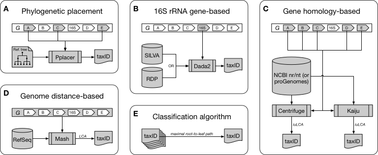

# CAMITAX: Taxon labels for microbial genomes



**The CAMITAX taxonomic assignment workflow.** CAMITAX assigns one NCBI Taxonomy ID (taxID) to each input genome *G* by combining phylogenetic placement with 16S rRNA gene-, gene homology-, and genome distance-based taxonomic assignments.

## Requirements

All you need is [Nextflow](https://www.nextflow.io/) and [Docker](https://www.docker.com/). If Docker is no option for you, please try [Sigularity](https://singularity.lbl.gov/) or manually install all dependencies (listed [here](nextflow.config) – easiest to install via [Bioconda](https://bioconda.github.io/))

## User Guide

### Installation

```
nextflow pull abremges/CAMITAX
```
That's all.

### Input

CAMITAX expects all input genomes in (genomic/nucleotide multi-)FASTA format.

If the genomes are in a folder `input/` with file extension `.fasta`, please run:
```
nextflow run abremges/CAMITAX --i input --x fasta
```

### Output

CAMITAX outputs a tab-seperated file containing the individual taxon assignments. **TODO**


## Citation

A manuscript describing the full scope of CAMITAX is currently in preparation.

In the meantime, please cite the GitHub repository and/or the CAMI manuscript:
* Sczyrba, Hofmann, Belmann, et al. (2017). **Critical Assessment of Metagenome Interpretation—a benchmark of metagenomics software.** *Nature Methods*, 14, 11:1063–1071. doi:[10.1038/nmeth.4458](https://doi.org/10.1038/nmeth.4458)
